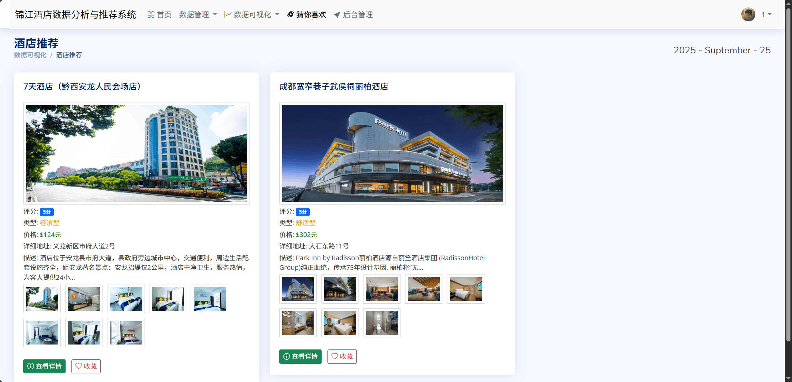
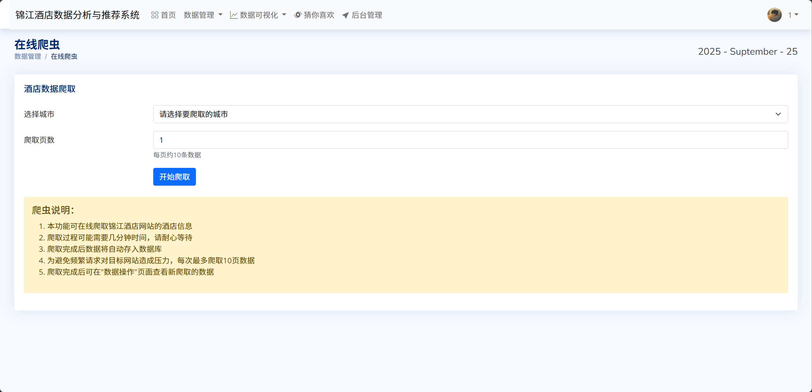

## 计算机毕业设计Django+Vue.js酒店推荐系统 民宿推荐系统 酒店可视化 民宿可视化 大数据毕业设计(源码+LW+PPT+讲解视频)


## 要求
### 源码有偿！一套(论文 PPT 源码+sql脚本+教程)

### 
### 加好友前帮忙start一下，并备注github有偿26酒店推荐分析
### 我的QQ号是 1679232425 或者798059319或者2827724252 或者微信:biyesheji1698 或者 bysj2023nb

# 

### 加qq好友说明（被部分 网友整得心力交瘁）：
    1.加好友务必按照格式备注
    2.避免浪费各自的时间！
    3.当“客服”不容易，repo 主是体面人，不爆粗，性格好，文明人。
## 主要功能 


```
随着在线旅游市场的快速发展和用户对个性化服务需求的不断增长，酒店推荐系统已成为提升用户体验和商业价值的重要工具。本项目基于真实的锦江酒店数据，设计并实现了一个完整的酒店数据分析与推荐系统。系统采用Django Web框架构建，集成了用户协同过滤推荐算法、多维度数据可视化分析、在线数据爬取、词云文本分析等核心功能模块。在推荐算法方面，系统实现了基于用户协同过滤的推荐策略，通过计算用户相似度和评分预测，为用户提供个性化的酒店推荐服务。系统还提供了丰富的数据可视化功能，包括价格分布分析、城市热力图、评分统计、类型分析等多个维度的数据展示。通过在线爬虫模块，系统能够实时获取最新的酒店信息，保证数据的时效性和完整性。经过功能测试和性能验证，系统能够有效提升用户的酒店选择效率，为酒店业务决策提供数据支持，具有良好的实用价值和推广前景。

技术特色与创新点
本项目在技术实现上具有以下特色和创新点，体现了现代Web开发和数据科学技术的有效结合：

算法创新方面：针对酒店推荐场景的特点，对传统协同过滤算法进行了优化改进。通过引入评分阈值和相似度阈值的双重过滤机制，有效提高了推荐结果的准确性和可靠性。同时，设计了智能的冷启动策略，解决了新用户推荐的难题，确保系统对所有用户都能提供有价值的推荐服务。

数据处理创新：采用了实时数据采集与离线数据分析相结合的混合架构。在线爬虫模块能够实时获取最新的酒店信息，而数据分析和推荐计算则采用离线处理方式，既保证了数据的时效性，又确保了系统的响应性能。

可视化技术特色：集成了多种数据可视化技术，不仅包括传统的统计图表，还融合了地图热力图、词云图等新颖的展示方式。通过ECharts的交互式图表功能，用户可以进行数据钻取和动态筛选，大大提升了数据探索的体验。

系统架构优势：采用Django的MVT架构模式，实现了良好的模块解耦和代码复用。通过中间件机制实现了统一的用户认证和权限控制，通过ORM技术简化了数据库操作，整个系统具有良好的可维护性和可扩展性。

用户体验创新：在界面设计上采用了响应式布局和现代化的UI组件，支持多种设备访问。同时，通过Ajax异步加载技术，实现了页面的局部刷新，提升了用户操作的流畅性和体验感。


```


## 运行视频
https://www.bilibili.com/video/BV1KgsJzyE8u

## 运行截图








